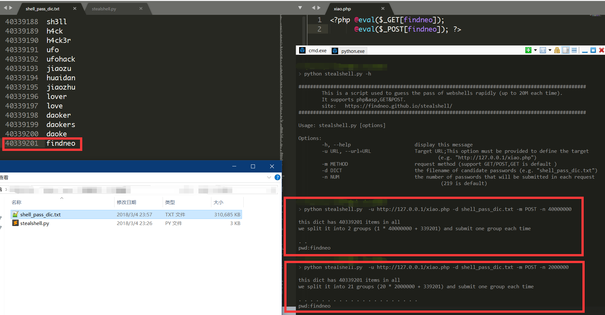

>  思路来自爱春秋文章[python之提速千倍爆破一句话 ](https://bbs.ichunqiu.com/thread-16952-1-1.html) ，据说源头是吐司文章《让你的一句话爆破速度提升千倍》。

速度提升的关键在于一次尝试提交多个可能的密码，实测在Apache+PHP下使用POST方式请求可高达四千万条密码每次（耗时约20秒，GET方式请求只能达到两百条左右），效果可以说非常惊人，如果有一个足够好的字典，那将无往不利。

```php
思路举例
慢速：
http://127.0.0.1/xiao.php?pass=echo(%22pwd:pass%22);
快速：
http://127.0.0.1/xiao.php?pass=echo(%22pwd:pass%22);&findneo=echo(%22pwd:findneo%22);
```

用法：

```python
Usage: stealshell.py [options]

Options:
        -h, --help                      display this message
        -u URL, --url=URL               Target URL;This option must be provided to define the target
                                                (e.g. "http://127.0.0.1/xiao.php")
        -m METHOD                       request method (support GET/POST,GET is default )
        -d DICT                         the filename of candidate passwords (e.g. "shell_pass_dic.txt")
        -n NUM                          the number of passwords that will be submitted in each request
                                                 (219 is default)


```

依赖库：
python2.7: requests,sys,getopt

效果如图：



脚本支持PHP和asp，asp部分没有搭环境测试，但只是payload简单替换，理论上是没有问题的。
